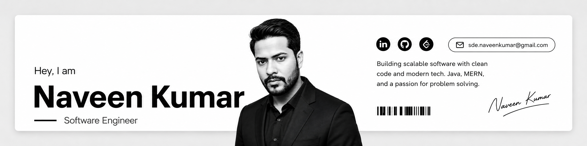

# Naveen Kumar
#### Software Engineer | Builder | Problem Solver

---

I build systems, products, and ideas that live on the internet instead of inside notebooks. 

--- 

**Connect** with me on :  [GitHub][github] , [Email][email] ,[LinkedIn][linkedin]

---

## Currently focused on:
- Data Structures & Algorithms
- System Design
- Backend Engineering
- Developer Tools
- Scalable Web Applications

---

I believe software engineering is not just about writing code.
It is about **_building systems_** that survive scale, **_pressure_**, **_users_**, **_failures_**, and **_time_**.

---

## Projects are where I learn best.

One of my major projects is **Rabbitfolio** — a platform focused on _developer portfolios_, _discoverability_, and creating an _ecosystem_ where builders can showcase what they create instead of just listing skills on a resume.

## I enjoy thinking deeply about:
- Product architecture
- Search systems
- GraphQL efficiency
- Developer experience
- AI-powered systems
- Automation
- Performance engineering

### My approach to engineering is simple:
#### Learn fast. Build fast. Improve forever.
---

I am constantly experimenting with [ideas][google], rebuilding systems from scratch, and studying how great products are designed under the hood.

> Some developers write tutorials.
> 
> Some developers clone projects.
>
> #### I prefer building things that feel alive.

## Tech Stack:
-   Java
    -   Data Structure & Algorithm
-   MERN Stack
    -   MongoDB
    -   Express.js
    -   React.js
    -   Node.js
    -   Html
    -   Css
    -   Tailwind
    -   Javascipt
-   DevOps
    -   Docker
    -   Git & GitHub
    -   CI/CD
    -   GitLab
-   REST APIs
-   Markdown

---

Beyond coding, I spend time learning how large-scale systems work — the kind of infrastructure that powers modern AI platforms, developer ecosystems, and internet-scale applications.

I admire engineers who combine creativity with execution.
Ideas are cheap. Systems are not.

> ### Current Mission:
>To become an engineer capable of building products that millions of people can use.

---

### Contact:

[github]:https://www.github.com/sdenaveenkumar

[linkedin]:https://www.linkedin.com/in/sdenaveenkumar 

[email]:sde.naveenkumar@gmail.com

“Build things that make people curious about how you built them.”